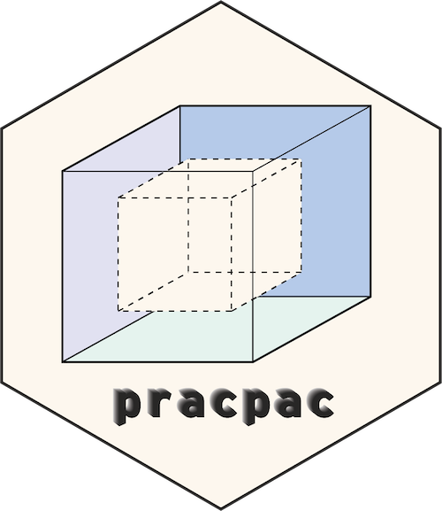
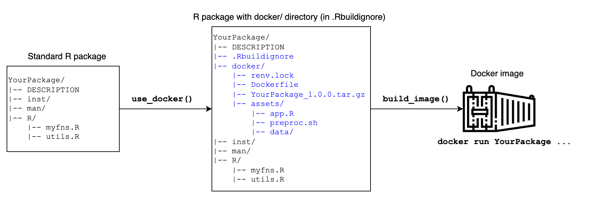

<!-- README.md is generated from README.Rmd. Please edit that file -->

# pracpac <a href='https://github.com/signaturescience/pracpac'></a>

<!-- badges: start -->

[](https://github.com/signaturescience/pracpac/actions/workflows/R-CMD-check.yaml)
[](https://CRAN.R-project.org/package=pracpac)
[](https://arxiv.org/abs/2303.07876)
<!-- badges: end -->

**pracpac**: Practical R Packaging with Docker

The goal of pracpac is to provide a usethis-like interface to create
Docker images from R packages under development. The pracpac package
uses renv by default, ensuring reproducibility by building dependency
packages inside the container image mirroring those installed on the
developer’s system. The pracpac package can be used to containerize any
R package and deploy with other domain-specific non-R tools, Shiny
applications, or entire data analysis pipelines.

## Installation

<!-- Install from CRAN with: -->

Install the development version of pracpac from
[GitHub](https://github.com/signaturescience/pracpac) with:

``` r
# install.packages("devtools")
devtools::install_github("signaturescience/pracpac", build_vignettes = TRUE)
```

## Example

Detailed documentation is available in the [basic
usage](https://signaturescience.github.io/pracpac/articles/basic-usage.html)
and [use
cases](https://signaturescience.github.io/pracpac/articles/use-cases.html)
vignettes:

``` r
vignette("basic-usage", package="pracpac")
vignette("use-cases", package="pracpac")
```

In the most simple example, running `use_docker()` inside of a package
directory will (1) capture all the package dependencies installed on the
developers system using [renv](https://rstudio.github.io), (2) build the
package source tar.gz, (3) create a Dockerfile which builds an image
with the package and its entire dependency chain, and (4) optionally
builds a Docker image with tags set using the version in the package
`DESCRIPTION`. The Dockerfile, `renv.lock` file, and the package source
tar.gz file will all be placed into a `docker/` subdirectory of the
package, which is added to the package’s `.Rbuildignore`. The workflow
is shown in the figure below.



For example, running `use_docker()` in the example package included in
pracpac at
[inst/hellow](https://github.com/signaturescience/pracpac/tree/main/inst/hellow)
will produce a Dockerfile with the following contents:

``` dockerfile
FROM rocker/r-ver:latest

## copy the renv.lock into the image
COPY renv.lock /renv.lock

## install renv and biocmanager
RUN Rscript -e 'install.packages(c("renv","BiocManager"), repos="https://cloud.r-project.org")'

## set the renv path var to the renv lib
ENV RENV_PATHS_LIBRARY renv/library

## restore packages from renv.lock
RUN Rscript -e 'renv::restore(lockfile = "/renv.lock", repos = NULL)'

## copy in built R package
COPY hellow_0.1.0.tar.gz /hellow_0.1.0.tar.gz

## run script to install built R package from source
RUN Rscript -e "install.packages('/hellow_0.1.0.tar.gz', type='source', repos=NULL)"
```

And an `renv.lock` with the dependencies of `hellow` (in this case just
the `praise` package):

``` json
{
  "R": {
    "Version": "4.0.2",
    "Repositories": [
      {
        "Name": "CRAN",
        "URL": "https://cran.rstudio.com"
      }
    ]
  },
  "Packages": {
    "praise": {
      "Package": "praise",
      "Version": "1.0.0",
      "Source": "Repository",
      "Repository": "CRAN",
      "Hash": "a555924add98c99d2f411e37e7d25e9f",
      "Requirements": []
    }
  }
}
```

By default, `use_docker()` does not actually build the image. You can
build the image with `build_image()` after running `use_docker()`, or in
one step using `use_docker(build=TRUE)`. This two-step procedure is
useful because other use cases may require edits to the Dockerfile to
install system libraries, or copy in Shiny app or pipeline-specific
code. See the [help page for
`?use_docker`](https://signaturescience.github.io/pracpac/reference/use_docker.html)
and the [use cases
vignette](https://signaturescience.github.io/pracpac/articles/use-cases.html)
(`vignette("use-cases", package="pracpac")`) for details.
